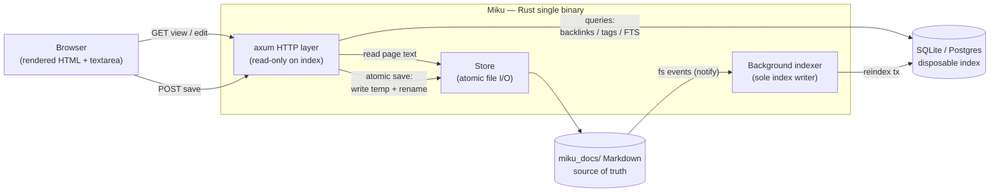
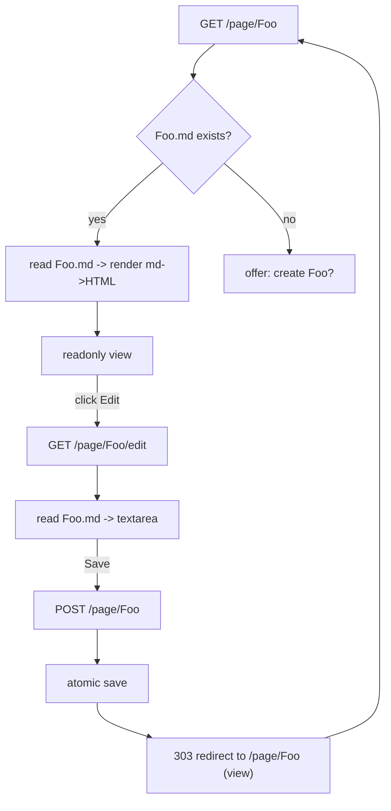
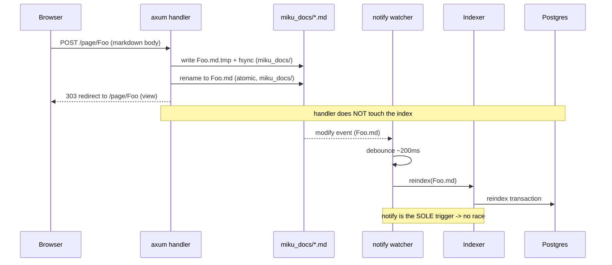
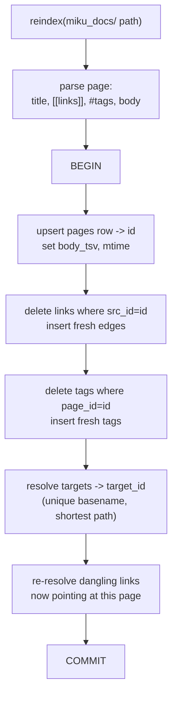
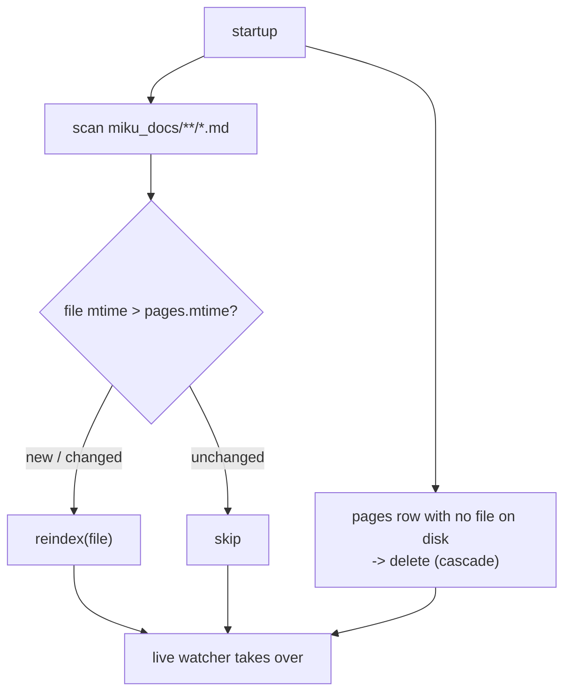
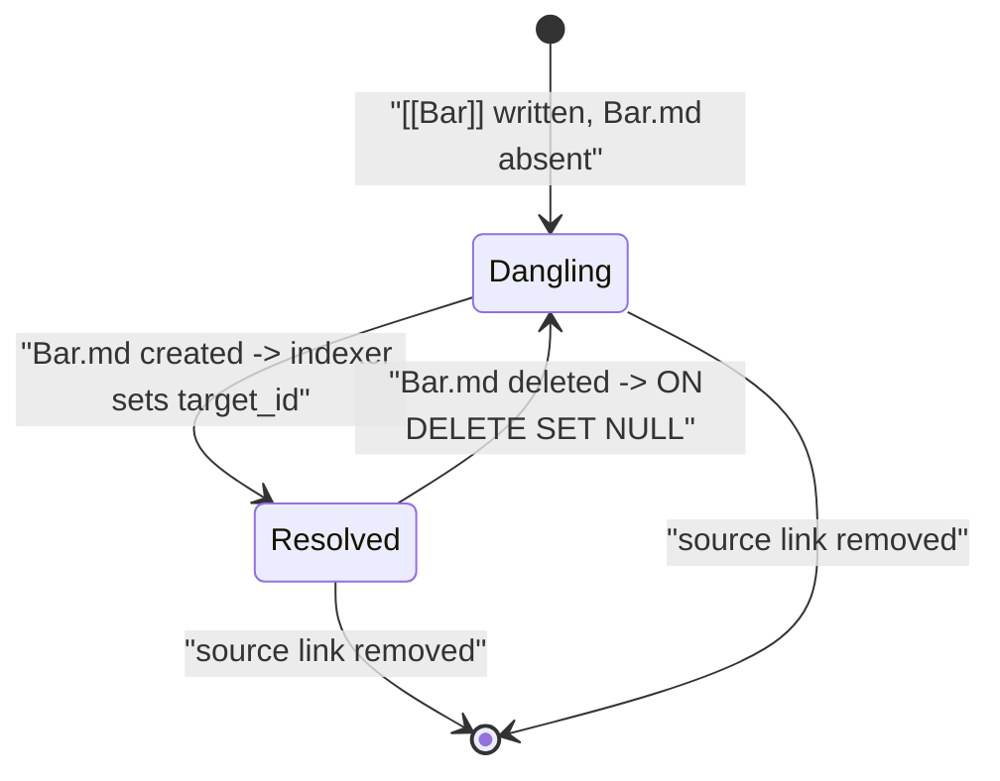
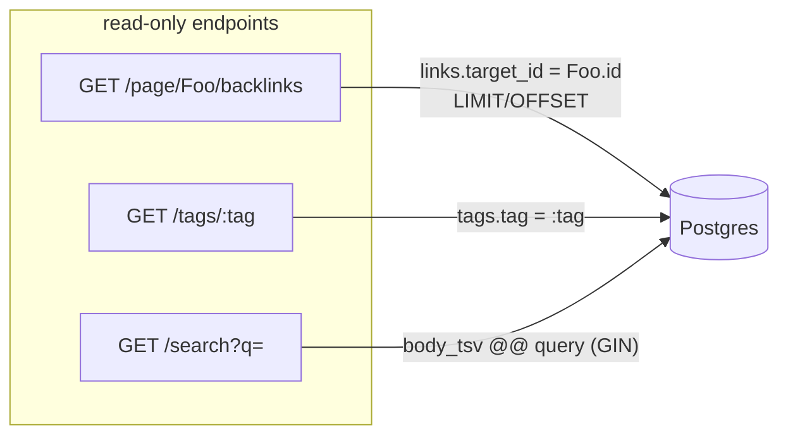
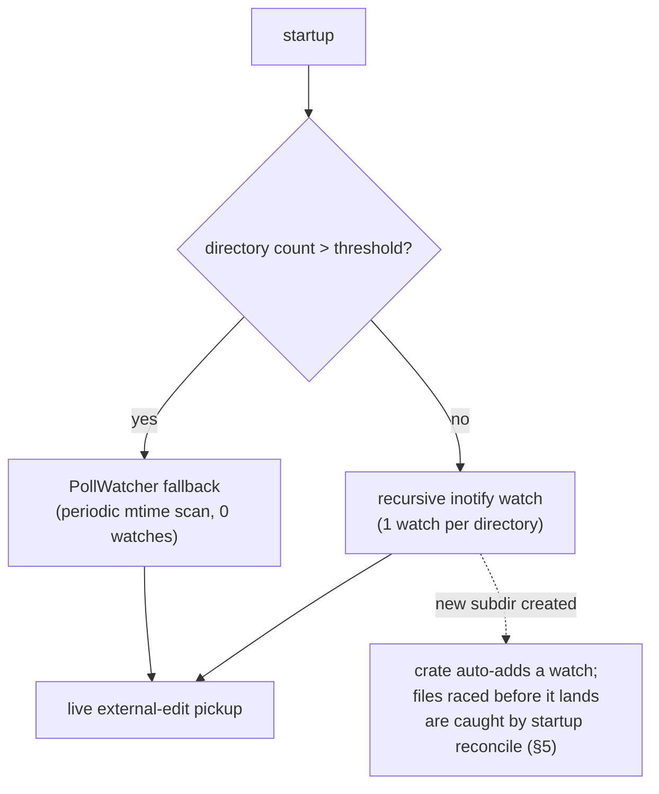

# Dataflow & Workflows

All diagrams are Mermaid. See `docs/architecture.md` for the prose design and schema. Watcher scaling (folder-scoped watching and fallbacks) is covered in §8.

## 1. System overview

Files are the source of truth; SQLite is the default disposable index, with
Postgres available as an explicit profile. HTTP handlers only **read** the
index; the background indexer is the **only** writer.

## 2. Rendering model — view vs edit (v0)

The readonly rendered view is the **primary** mode; editing is opt-in. Classic wiki model, no client JS.

## 3. Save → index contract (single-writer, no race)

The save handler writes the file and returns. It **never** touches the index. The `notify` watcher is the sole index trigger, so there is no double-index and no save↔index race.

## 4. Reindex-one-page transaction

One page reindex is a single Postgres transaction.

## 5. Startup reconcile

`notify` can miss events while the process is down, so startup does a full mtime-based reconcile before the live watcher takes over.

## 6. Link lifecycle (dangling ↔ resolved)

A `[[link]]` may point at a page that does not exist yet. Backlinks appear the moment the target is created; they go dangling again if it is deleted.

## 7. Read-path queries (no filesystem touch)

Backlinks, tags, and search read **only** Postgres — never the filesystem — and are paginated so the full edge set is never loaded at once.

## 8. Watcher scale — folder-scoped watching

`notify` subscribes at **directory** granularity, so the watch budget scales with directory count, not file count. On Linux an inotify watch is added **per directory** and reports events for every
file directly inside it; `RecursiveMode::Recursive` adds one watch per subdirectory (auto-adding one when a new subdir appears). macOS FSEvents watches paths, with no per-file limit.

- 100k files across ~200 folders → ~200 watches (default `fs.inotify.max_user_watches` is 65k–524k — not close).
- 100k files in one folder → 1 watch.

This is why Miku needs no second store to "scale the watcher": an earlier plan (a rejected RocksDB work-queue detour) misdiagnosed the inotify limit as per-file. Three levers, in order of preference:

1. **Watch folders (default)** — already how recursive mode behaves; covers any realistic wiki.
2. **Raise the sysctl** — document `fs.inotify.max_user_watches` for the rare deep-tree case.
3. **`PollWatcher` fallback** — zero inotify watches, trading latency for budget; only past a genuinely extreme directory count.

A file created in a brand-new directory before its watch registers can be missed; recursive mode auto-registers the new dir and the startup reconcile (§5) sweeps anything missed, so it self-heals.
