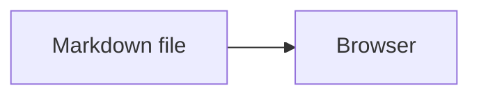

## Rendering

This page exercises the reader's Markdown support. #demo

> [!NOTE] A note alert rendered from GitHub alert syntax.

> [!WARNING] A warning alert rendered from GitHub alert syntax.

## Diagram

## Math

Inline math such as $x^2 + y^2 = z^2$ and a display equation:

$$
E = mc^2
$$

## Links

See [[features]], [[usage]], [[changelog]], and [[index|Home]].
