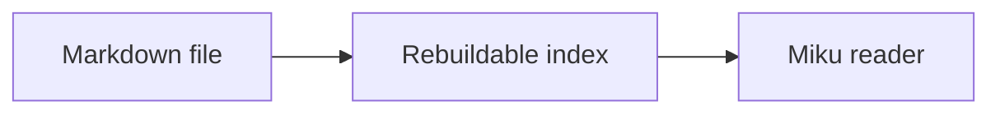

# Miku Note Features

Miku Note is a filesystem-owned Markdown wiki with a thin browser reader and a
rebuildable background index. This page lists what is available now; deferred
ideas are kept at the end so the product boundary stays honest. #feature #guide

> [!NOTE]
> Markdown files under `miku_docs/` are the source of truth. The index is
> disposable and can be rebuilt from those files.

## Filesystem ownership

Notes remain ordinary `.md` files under `miku_docs/`. They can be edited with
Miku Note, a text editor, scripts, or git. The database is an index projection;
Markdown files remain the canonical copy of your content.

## Reader-first navigation

The readonly reader is the primary experience. Direct page URLs use `/p/...`,
so links, bookmarks, and direct browser routes continue to work normally.
Switching between notes keeps the application shell mounted and swaps only the
reader fragment; the document, shared JavaScript, and CSS remain loaded.

The reader includes:

- a collapsible filesystem explorer;
- breadcrumbs, backlinks, unlinked mentions, and page properties;
- a Context panel with backlinks, tags, page properties, and a jumpable table
  of contents;
- a draggable workspace and Context panel;
- light/dark themes with a Miku/Tolaria-inspired semantic palette;
- a quick search panel opened by `Cmd-K` / `Ctrl-K`.

## Markdown and rich rendering

The Rust renderer supports CommonMark/GFM features including tables,
strikethrough, task lists, autolinks, footnotes, alerts, and raw HTML for
trusted local files.

Miku Note also supports:

- `[[Page]]` wikilinks, aliases, and missing-link styling;
- `![[asset.png]]` asset embeds;
- inline `#tags` and YAML frontmatter properties;
- fenced Mermaid diagrams;
- fenced code blocks with language-aware syntax highlighting;
- inline and display LaTeX-style math (`$...$` and `$$...$$`).

Mermaid and KaTeX are loaded by the reader for content that uses them. Syntax
highlighting and these math/diagram enhancements are progressive: the original
Markdown remains the editable source of the page.

### Common authoring use cases

Render a flow or sequence diagram with a fenced `mermaid` block:

````markdown

````

Use single dollar signs for inline math and double dollar signs for a display
equation:

```markdown
Inline: the area is $A = \pi r^2$.

$$
\int_0^1 x^2\,dx = \frac{1}{3}
$$
```

Other reader-oriented examples include:

- `> [!TIP]` and the other GitHub-style callouts for explanations or warnings;
- fenced `js`, `rust`, or `bash` blocks for highlighted source with copy action;
- GFM tables, task lists, footnotes, strikethrough, autolinks, and raw HTML;
- `[[Design/Home]]` for a note link, `[[Design/Home|design]]` for an alias, and
  `![[diagram.png]]` for an asset or note embed;
- `#project/miku` in prose or YAML `tags` frontmatter for indexed tags.

Mermaid diagrams are rendered in the browser and may show a readable error
block when the diagram source is invalid. Math is rendered as presentation
output; the original Markdown remains the editable source.

## Wikilinks, backlinks, and mentions

Write `[[PageName]]` to connect notes. Matching is case-insensitive, and links
can include a display alias such as `[[Index|Home]]`.

When a note links to another note, the target page shows explicit backlinks.
Each backlink shows the source note title and path and opens that source note;
the indexer also records plain-text mentions as a secondary discovery surface.

## Tags and search

Use tags such as `#docs`, `#feature`, or `#area/sub` anywhere in prose. Tags
from Markdown and frontmatter are indexed together.

Tag workflow example:

```yaml
---
tags: [project/miku, markdown]
---
This note is also discoverable through #project/miku.
```

Tags are clickable in the note metadata and Context panel. The Tags page starts
with ten tags and loads another ten when its list reaches the scroll sentinel;
selecting a tag opens its indexed note list.

- `/tags` shows the tag index and loads more results as you scroll;
- `/tags/<tag>` shows matching pages and also uses scroll-triggered paging;
- `Cmd-K` opens the quick-search palette. It searches Pages, Content, or All,
  keeps results scrollable, and supports arrow-key selection plus Enter to open;
  the indexed result path remains a projection while Markdown is the content
  source of truth.

## Editing and safe writes

Editing is opt-in from the reader. The inline editor uses CodeMirror 6 and
loads its editor modules only when editing starts; use the `Edit` action in the
note toolbar to enter it.

Saving writes a temporary file, flushes it, and atomically renames it into
place. A changed-file hash protects against overwriting edits made elsewhere.

## Background indexing

The filesystem watcher is the sole live index trigger. After a file changes, it
updates links, tags, aliases, mentions, full-text search data, and rendering
metadata for that page. HTTP handlers read the index and do not perform an
inline reindex.

The index is rebuildable from `miku_docs/**/*.md`. The local runtime uses
SQLite via SQLx by default; larger deployments can select the supported
Postgres profile. The index accelerates
navigation and relationships; body search remains the dedicated full-text mode.

## File ownership boundary

The file tree is read-only in the current release. Miku does not move, rename, delete, or
trash pages. Use the editor for content changes and use your filesystem, editor,
scripts, or git when changing paths or removing files; the watcher reconciles
those external changes into the disposable index.

## Freshness and external edits

Miku Note keeps the event stream active only while the editor is open. The
active page checks for a newer indexed version periodically and refreshes when
the tab becomes visible again. This keeps reading lightweight while still reflecting
changes made by git, an editor, or another process.

## Deliberately deferred or rejected

The following items remain outside the current feature set:

- mobile or offline-first applications;
- real-time collaboration and CRDT editing;
- built-in encryption or cloud sync;
- a Notion-style database/block model;
- a plugin runtime or general client-side application framework;
- graph/canvas view;
- drag-and-drop asset upload;
- Dataview-style queries and daily-note/calendar workflows;
- MDX/JSX as a Markdown rendering requirement.

For a hands-on compatibility page, see [[Sandbox]]. For setup instructions,
see [[Usage]].
