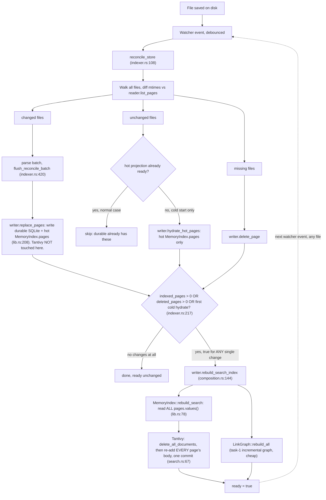
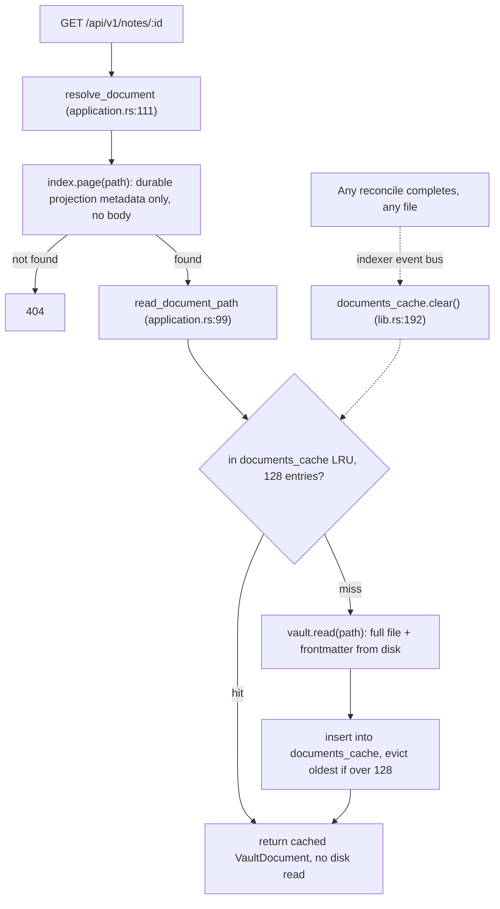

## Miku Architecture

Miku is a filesystem-owned Markdown workspace. The files under miku_docs/ are the product data; Rust services and indexes make those files navigable without creating a second source of truth.

### Repository shape

```text
repo/
├── crates/
│   ├── miku/                    # binary and HTTP transport
│   ├── miku-app/                # application services and composition
│   ├── miku-domain/             # backend-neutral contracts and records
│   ├── miku-vault/              # safe Markdown filesystem adapter
│   ├── miku-markdown/           # Markdown parsing and source transforms
│   ├── miku-indexer/            # filesystem-to-index projection builder
│   ├── miku-index-memory/       # hot graph projection (ADR-0019/ADR-0020)
│   ├── miku-index-sqlite/       # local durable projection and rayon search (ADR-0020)
│   ├── miku-index-postgres/     # optional scale projection
│   └── miku-cache-valkey/       # optional best-effort cache
├── miku-web/                    # React, TypeScript, Vite frontend
└── miku_docs/                   # authoritative Markdown vault
```

### Source and projection boundary

miku_docs/\*_/_.md and user assets are authoritative. miku-vault owns safe path normalization, atomic file operations, Markdown frontmatter, revisions, and scans. It does not own search or backlinks.

miku-domain defines the stable vocabulary shared by the vault, indexer, application, and projection backends: notes, links, tags, revisions, search requests, and index capabilities. It intentionally
contains no filesystem or database implementation.

The index is disposable. The default runtime uses local SQLite for durable metadata and full-text search, with MemoryIndex as a rebuildable in-process graph projection. Postgres and Valkey are
optional scale components. Tantivy was removed by ADR-0020. Rebuilding any projection from miku_docs/ must recover the same searchable relationships.

### Runtime flow

1. miku-vault reads the requested Markdown source.
2. miku-app composes vault access, workspace policy, and index readers.
3. miku exposes the application through the versioned JSON API.
4. The background indexer watches folders, debounces filesystem events, parses changed notes, and updates projections.
5. miku-web keeps route, tabs, tree, search, and reader state in the browser.

HTTP handlers read projections and source documents. They do not synchronously rebuild indexes. A save writes atomically; the watcher schedules reconciliation. Startup reconciliation catches changes
missed while the process was stopped.

### Historical reconcile and Tantivy rebuild (pre-ADR-0020)

This section preserves the measured pre-ADR-0020 workflow that motivated removal of Tantivy. It is historical evidence, not current runtime documentation. The current implementation stores bodies
once in SQLite, searches its plain body column in parallel Rust code, and keeps body-free graph metadata in MemoryIndex. See ADR-0020 and “What is actually stored where” below.

#### User story: editing one note while Miku is running

Haru is running Miku against the live 15,910-file `miku_docs` vault. The process has been up for a while, so its hot projection is already `ready`. She opens `Notes/Foo.md` in her editor, changes one
paragraph, and saves.

1. The filesystem watcher notices the write and schedules a reconcile (rapid saves are debounced into one run).
2. `reconcile_store` walks **all 15,910 files again**, compares each one's mtime against what the index already has, and finds exactly one changed file: `Notes/Foo.md`.
3. It parses that one file and calls `replace_pages` with a batch of one page. This writes the new body into SQLite (`tb_pages`/`tb_pages_fts`, durable) and into `MemoryIndex.pages` (hot) — Tantivy is
   not touched yet.
4. Because one page changed, `rebuild_search_index` runs.
5. `MemoryIndex::rebuild_search` reads every page currently in `MemoryIndex.pages` — all 15,910 of them, not just `Foo.md` — deletes Tantivy's entire index, and re-adds every page's `body` in one
   commit.
6. For step 5 to produce correct search results, the other 15,909 pages' `body` fields must still be sitting in memory in full, even though none of them changed. If any had been cleared to save memory
   after their own first indexing, Tantivy would now silently lose their content.
7. When Haru reopens `Foo.md` in Miku, what she sees is read straight from disk through `miku-vault` — never from the index. The index was never the source for the content she's viewing; it only makes
   the file findable and linkable.

The surprising part of this story is step 5-6: editing **one** file re-touches the in-memory copy of **every** file, which is why the whole corpus's bodies stay resident for the life of the process
rather than only the recently-edited ones.

#### Workflow



**1. Composition and the `ready` flag.** `compose_projections` (`crates/miku-app/src/composition.rs:15-33`) pairs one `DurableProjection` (`SqliteIndex`) with one `HotProjection` (`MemoryIndex`) behind a
shared `AtomicBool` named `ready`, starting `false`. `ComposedReader::active()` (`composition.rs:41-48`) reads from `durable` while `ready` is `false`, and from `hot` once it flips `true`.
`ComposedWriter::rebuild_search_index` (`composition.rs:144-150`) is the only place that sets `ready = true`; nothing ever resets it back to `false` except a hot-projection write failure calling
`degrade()` (`composition.rs:113-115`).

**2. `reconcile_store` runs at startup, then again on every filesystem change, for the life of the process.** It is called once at process start (`crates/miku/src/indexer.rs:482`), then again every time
a watcher event fires, inside an unbounded `while let Some(event) = receiver.recv().await` loop (`indexer.rs:503-514`). It is not a one-shot cold-start routine.

**3. Inside one `reconcile_store` call** (`indexer.rs:108-` onward): it walks `content_root` for every `.md` file (`walk_store_tree`), diffs each file's mtime against `reader.list_pages()` to split files
into `changed_files` and `unchanged_files`, then:

- Parses `changed_files` in batches and calls `flush_reconcile_batch` (`indexer.rs:420-437`), which calls `writer.replace_pages(pages)` — the **bulk** write path, for every reconcile, not just
  cold start.
- If the hot projection was not yet `ready` (true cold start only), also parses `unchanged_files` and calls `writer.hydrate_hot_pages(pages)` to warm the hot projection without re-touching the
  durable store.
- Deletes pages no longer present on disk via `writer.delete_page`.
- If `indexed_pages > 0 || deleted_pages > 0 || (!is_already_ready && hot_hydrated)` (`indexer.rs:217-220`) — true for **any** single changed or deleted file, on every reconcile — it calls
  `writer.rebuild_search_index()`.

**4. `replace_pages` never touches Tantivy.** `MemoryIndex::replace_pages` (`crates/miku-index-memory/src/lib.rs:208-227`) only inserts into `pages: BTreeMap<String, PageIndex>` (the field that holds
each page's full parsed body). Tantivy indexing for the bulk path is deferred entirely to the next step. This batching is intentional: Tantivy's writer/commit cost is high per call, so committing once
per reconcile instead of once per page avoids expensive repeated commits.

**5. `rebuild_search_index` performs a full wipe-and-rebuild from whatever is currently in `pages`, not an incremental update.** `MemoryIndex::rebuild_search` (`miku-index-memory/src/lib.rs:78-87`) reads
`pages.values().cloned()` — every page currently held in memory, regardless of whether it changed in this reconcile — and passes all of them to `SearchProjection::rebuild`
(`miku-index-memory/src/search.rs:67-89`), which calls `writer.delete_all_documents()` then re-adds every page's `body` field in one Tantivy commit.

**The load-bearing consequence:** because step 5 rebuilds Tantivy from *all* of `pages` on *every* reconcile that has any change (step 3's condition), and step 3 runs repeatedly for the life of the
process (step 2), every page's `body` must remain valid in `MemoryIndex.pages` indefinitely — not just until it is first indexed. Clearing `body` after indexing to save memory would cause the *next*
reconcile (triggered by editing even one unrelated file) to wipe full-text search for every page whose `body` had been cleared. This is why `MemoryIndex` currently holds the entire corpus's Markdown
bodies resident for the life of the process, and is the actual cause of the ~2.27 GB RSS measured reconciling the live 15,910-file `miku_docs` corpus (ADR-0019 implementation status) — not an oversight
to delete, but a real constraint of how the rebuild is wired today.

**6. Page content for reading/editing never comes from the index.** `IndexReader::page`/`list_pages` return `PageSummary` (`crates/miku-domain/src/lib.rs:33-42`), which has no body field at all; actual
note content is read straight from disk through `miku-vault` (`crates/miku-app/src/application.rs:103`, `crates/miku-app/src/workspace.rs:64,71`). Search result snippets come from Tantivy's own
`STORED` copy of `body` (`miku-index-memory/src/search.rs:26,124-127`), not from `MemoryIndex.pages`. The only reader of `PageIndex.body` in `MemoryIndex.pages` is step 5's full rebuild.

#### What is actually stored where

Four separate stores exist, not one "index." None of them holds the same shape of data:

| Store | What it holds | Bound | Where |
|---|---|---|---|
| `miku_docs/**/*.md` | Full Markdown + YAML frontmatter. The only source of truth. | Unbounded — this is the vault, not a cache. | Disk |
| `documents_cache` (`crates/miku-app/src/application.rs:20-25`) | Parsed `VaultDocument` (frontmatter + full body) for **recently opened notes only**. Hand-rolled LRU: `HashMap` + `VecDeque` order, evicts oldest on overflow (`application.rs:41-49`). | `DOCUMENT_CACHE_CAPACITY = 128` documents (`application.rs:20`) | Process RAM |
| `tb_pages` (SQLite, `crates/miku-index-sqlite`) | Per-page `path, title, body, frontmatter, has_mermaid, mtime` (`tb_pages`). No `tb_pages_fts` virtual table per ADR-0020. Searches raw body via `rayon` parallel scanning. | Every page in the vault — disk-backed (`282.2MB`), flat single-copy footprint. | Disk (`miku_docs/.miku-index.sqlite`), OS-cached |
| `MemoryIndex` (`crates/miku-index-memory`) | `pages: BTreeMap<String, PageIndex>` — page summary, links, tags, aliases, signals (`body` and `frontmatter` stripped per ADR-0020). `graph: LinkGraph` — `slug_index`/`path_index`/`backlinks`. Tantivy removed entirely per ADR-0020. | Fast in-memory graph resolution without holding raw page text or frontmatter ASTs resident in RAM. Reconcile peak RSS **378MB** (down from ~2.27GB baseline, **83% reduction**). | Process RAM |

#### Read path: opening pages

Opening a note is read-only. It never writes to SQLite or `MemoryIndex`, and never triggers a reconcile. `GET /api/v1/notes/{id}` (`crates/miku/src/http_api.rs:220-231`) calls
`application.read_note` → `resolve_document` (`crates/miku-app/src/application.rs:111-145`), which:

1. Checks `self.index.page(path)` against the durable projection—a cheap existence/metadata check that never returns a body.
2. Calls `read_document_path` (`application.rs:99-109`), which checks the 128-entry `documents_cache` **first**. On hit, returns the cached `VaultDocument` — no disk read, no index touched.
3. On a cache miss, reads the file directly from disk via `self.vault.read(path)` (`application.rs:103`), then inserts it into `documents_cache`, evicting the least-recently-touched entry if the cache
   is already at 128.

Opening several different pages just fills this 128-entry LRU one page at a time; it has no effect on SQLite or `MemoryIndex` at all. The two are only ever written by the reconcile workflow above,
triggered by file changes — never by page views.

**One cross-cutting invalidation:** `documents_cache` is fully cleared — not selectively — every time the indexer's event bus fires (`crates/miku/src/lib.rs:190-194`, subscribing to the same broadcast
channel the reconcile workflow above sends on). So editing *any* file, even one you're not viewing, empties the entire 128-entry cache for everyone, and the next open of any note is a fresh disk read.



### Frontend boundary

The browser frontend is a separate Vite project. Its structure follows features rather than delivery history:

- src/app/ owns route composition.
- src/features/workspace/ owns workspace state, API clients, and the shell.
- src/features/markdown/ owns editor and reader integrations.
- src/components/workspace/ owns reusable tree, notice, and icon components.
- src/shared/ owns cross-feature UI state and pure helpers.

Tailwind provides shell utilities and tokens; Tailwind Typography owns generic Markdown typography; React Markdown plus Prism, Mermaid, and KaTeX provide the rendering pipeline. Miku-specific CSS is
limited to interaction behavior, alerts, links, diagrams, and shell details.

### Link and metadata model

Obsidian-style wikilinks, Markdown links, aliases, embeds, tags, and unlinked mentions are parsed from source Markdown. Explicit /p/<path>.md links remove ambiguity; unique basename wikilinks remain
convenient. Backlinks are derived index edges and never require scanning candidate files during a page request.

Every first-party note uses YAML frontmatter for stable metadata. The minimum convention is title, type, status, tags, and updated; ADRs also carry an immutable id.

### Note Context and Outgoing Link Resolution (ADR-0022)

`GET /api/v1/note-context/{id}` assembles a single <15ms response containing `note`, `parents`, `children`, `backlinks`, and `outgoing` link items.

The backend index (`MemoryIndex` / `SqliteIndex`) resolves target paths for every outgoing link:

- Existing target notes resolve to their exact canonical vault path (`is_missing: false`).
- Uncreated target notes resolve to their relative folder directory (`is_missing: true`).

The frontend performs zero global page prefetching or client-side link resolution; `MemoryIndex` remains synchronized via:

1. OS Filesystem Events (`notify` watcher) for local disk file edits.
2. Synchronous `save_note()` writes (`ComposedIndexWriter`) for Web UI edits.
3. Startup file mtime reconcile sweeps (`reconcile_store()`) on server restarts.
